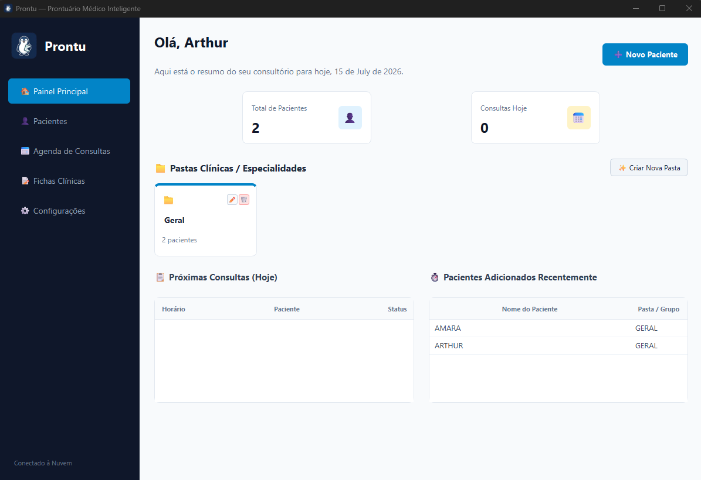
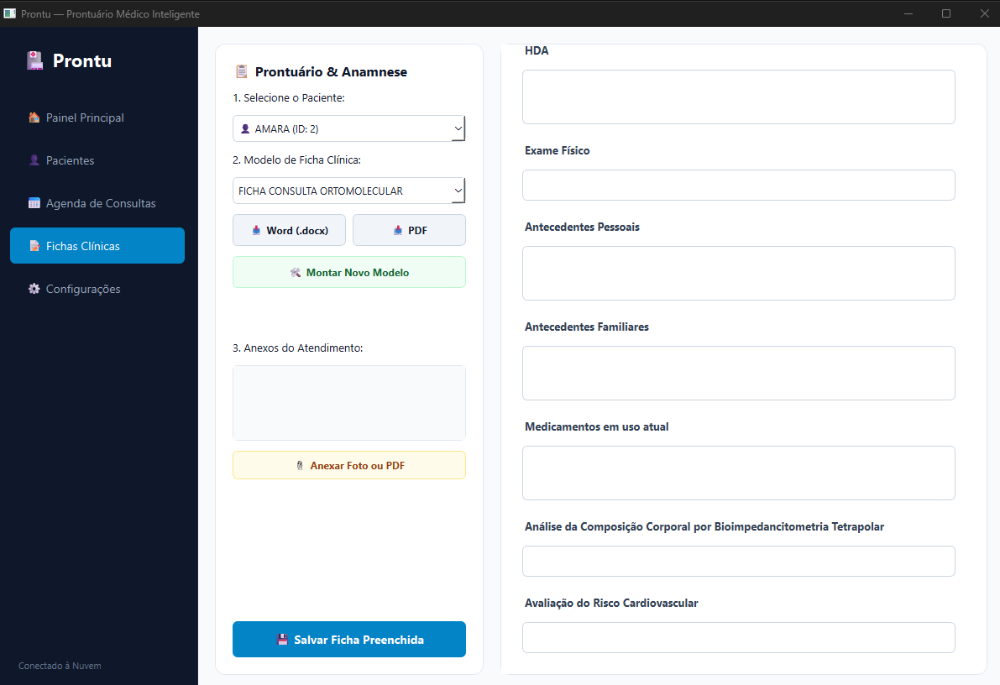
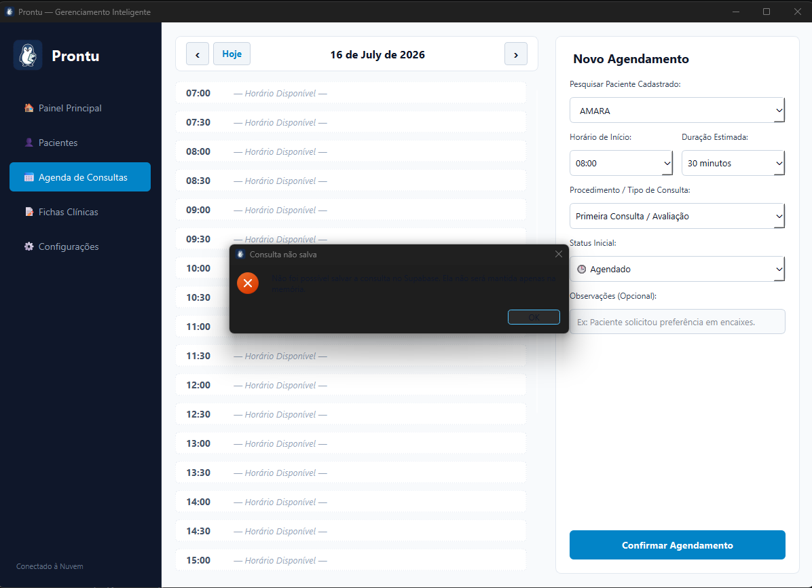
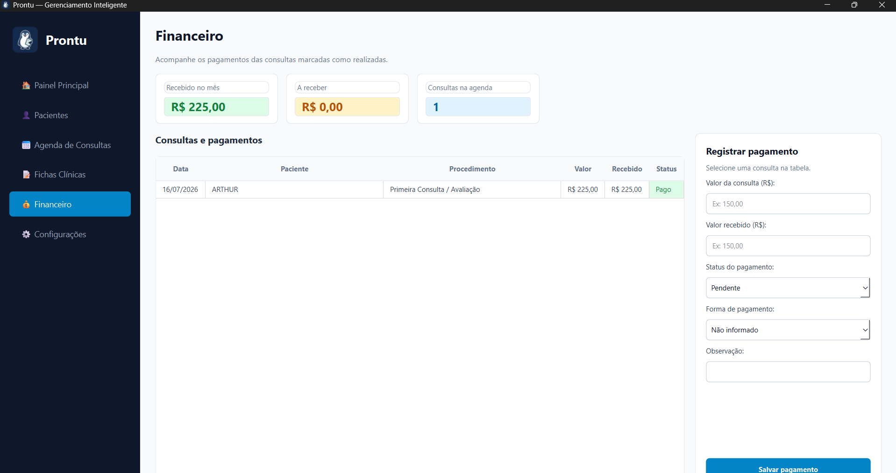

# Prontu

<p align="center">
  
</p>

<p align="center">
  <strong>Intelligent clinic management for desktop.</strong><br>
  A focused workspace for patient care, appointments, clinical records, payments, and team collaboration.
</p>

---

## Overview

Prontu is a desktop-first clinic management application built for the daily routine of small healthcare practices. It brings patient information, clinical records, appointments, financial follow-up, document exports, encrypted backups, and shared team access into one clear workspace.

The product is designed to be delivered as a Windows application. End users should work with the installed product, not configure Python, databases, or cloud infrastructure.

## Core capabilities

- **Patient management** — searchable patient profiles, specialty folders, clinical history, and follow-up scheduling.
- **Clinical records** — create, fill, edit, review, archive, and export records linked to each patient.
- **Template builder** — create custom record models with sections, text fields, dates, numbers, checkboxes, and multiple-choice inputs.
- **Smart agenda** — daily and weekly appointment views, conflict prevention, status tracking, and direct access to the patient record.
- **Financial follow-up** — appointments feed the payment panel automatically; received, pending, and overdue amounts are clearly identified.
- **Returns and follow-ups** — schedule expected patient returns and keep the next action visible in the patient workflow.
- **Professional exports** — generate Word and PDF documents from patient and clinical-record data.
- **Encrypted local backup** — configure a secure destination, retention policy, optional attachment metadata, and a recovery password.

## Team workspace

Prontu supports individual accounts for a shared clinic database. Each person signs in with their own email and password, while all approved members work within the same clinic scope.

| Role | Access |
| --- | --- |
| **Owner** | Full operational access, team invitations, access revocation, role changes, and audit history. |
| **Professional** | Full operational access to patients, clinical records, agenda, returns, finance, exports, and settings. |
| **Secretary** | Basic patient registration and appointment management, without access to clinical records, attachments, finance, settings, or team administration. |

Owners can create invitations, select the invited role, regenerate invitation codes, revoke access, and manage the number of active seats allowed by the clinic plan.

## Screenshots

### Dashboard



### Patient management



### Appointment scheduling



### Financial tracking



## Technology stack

| Area | Technologies |
| --- | --- |
| Desktop application | Python 3.11, PySide6 (Qt for Python) |
| Cloud data | Supabase, PostgreSQL, Row Level Security |
| Authentication and team operations | Supabase Auth, Supabase Edge Functions, TypeScript / Deno |
| Documents | python-docx, PySide6 Qt Print Support, pypdf |
| Local security | cryptography, keyring |
| Connectivity and configuration | httpx, python-dotenv |
| Windows distribution | PyInstaller-ready desktop application, designed for installer delivery |

## Architecture

```text
Prontu
├── main.py                 Application entry point
├── database/               Supabase access, session management and secure local storage
├── ui/
│   ├── main_window.py      Navigation shell, role-aware menus and shared application behavior
│   ├── screens/            Dashboard, patients, agenda, records, finance, team and settings
│   └── assets/             Product branding and visual assets
├── services/               Backup and background-work services
├── supabase/
│   ├── migrations/         PostgreSQL schema, Row Level Security policies and database evolution
│   └── functions/          Activation, login, password reset and team-management APIs
└── tests/                  Automated regression checks
```

The desktop interface communicates with Supabase through a small Python data layer. PostgreSQL migrations define data structure and policies; Edge Functions handle sensitive operations such as activation, account creation, invitations, role changes, and password recovery without exposing privileged credentials in the desktop application.

## Data and security

- Every clinic operates in its own data scope through `consultorio_id`.
- Supabase Row Level Security reinforces clinic and role boundaries at database level.
- Each team member has an individual account and can be revoked by the clinic owner.
- Audit history records operational events without exposing clinical content in the audit interface.
- Device activation and session handling keep privileged database credentials out of the desktop application.
- Local backup files are encrypted and can be protected with a recovery password.

Prontu provides technical safeguards for a small-practice workflow. Legal compliance, privacy policies, retention rules, and operational procedures must be defined by each clinic before production use.

## Product direction

Prontu is evolving into a polished Windows product for small healthcare practices: simple enough for a local clinic, structured enough for a collaborative team, and ready to grow through plan-based features and installer-based distribution.

## Author

**Arthur Florencio Afonso**
[GitHub](https://github.com/arthurflorencio) · [LinkedIn](https://www.linkedin.com/in/arthur-florencio-afonso/)
